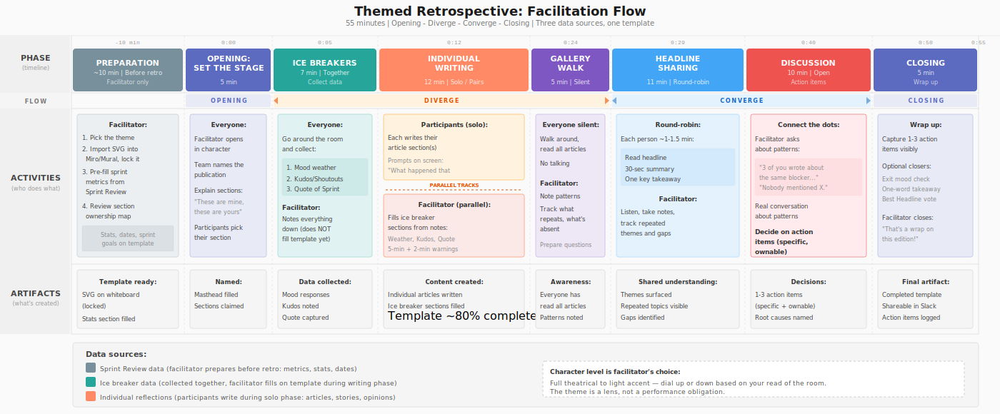

# The Themed Retrospective: Same Format, Different Lens

*This is Part 1 of a 5-part series on unconventional retrospectives that can surprise and open your team. Stay tuned.*

Hello everybody, Ted Lozzo is here!

Let me paint you a picture. It's 4pm on a Friday. Your team shuffles into a meeting room (or a Zoom call, let's be honest). The facilitator opens a Miro board with three columns: "Went Well," "Didn't Go Well," "Action Items." Someone sighs. Someone else is already on their phone. You go through the motions. You write the same vague sticky notes you wrote two weeks ago. You leave feeling like you just lost 45 minutes of your life.

**Sound familiar? That's because your retrospective format is dead.** And you're performing a ritual over its corpse.

Here's the thing: the retrospective itself isn't broken. The *format* is. Teams do the same three-column exercise until their brains go on autopilot. The result? Surface-level feedback, zero engagement, and action items nobody follows up on.

The fix is stupidly simple: **change the lens, not the structure.**

---

## One Format, Many Themes

Let me be clear about what I'm proposing. The retrospective structure stays exactly the same. What changes is the **theme** — the creative wrapper around the reflection. Instead of "what went well?", you ask "if a journalist followed our team this sprint, what story would they write?" Instead of a sticky note, someone writes a short "news article." Instead of the facilitator saying "let's get started," they say "welcome to the newsroom, reporters."

**The theme is a lens, not a game.** It reframes the same questions your team would answer anyway, but in a way that bypasses the autopilot response. When someone writes a "witness statement" instead of a "challenge," they go deeper. When they draft a "hypothesis vs reality" report instead of a "what we learned" note, they're more honest about the gap between plan and execution.

The theme is also **leverage**. A "weather report" gets you team mood data without the awkwardness of "how is everyone feeling?" A "classified ad" gets people to ask for help without vulnerability. "Suspect profile" gets you root cause analysis without finger-pointing. The metaphor isn't decoration — it's a tool that lowers the barrier to honesty.

---

## The Facilitation Structure

Here's how the whole thing works. 55 minutes, seven phases. The session opens together, diverges into individual work, and converges back into shared discussion. Think of Opening and Closing as bookends — the real flow is: diverge (ice breakers, writing, gallery walk) then converge (sharing, discussion).

**A note on complexity.** This is not a format for your first facilitation. Running a themed retro requires tight time management across seven phases, the ability to collect data from the group and fill template sections while others write, reading the room to calibrate how much character to play, and enough facilitator confidence to redirect a fun exercise back to a hard conversation. You need to be comfortable multitasking — noting ice breaker data while keeping energy up, polishing template sections while the team writes, tracking patterns during the gallery walk, and steering the discussion toward action items with 10 minutes left. If you've facilitated a few standard retros and feel solid with the basics, you're ready. If you're still figuring out how to keep a meeting on time, start there first and come back to this.

**A note on character.** How much you lean into the role — Editor-in-Chief, Lab Director, Commentator — is entirely up to your taste and your read of the room. Some facilitators go full theatrical. Others keep it to a light accent on the opening and closing. Both work. The theme is a lens, not a performance obligation. Dial it up or down based on what serves the team.

Before I walk you through each phase, you need to understand the three types of data that fill a template. Every section on the template belongs to exactly one of these categories, and the facilitator needs to know which is which before the session starts.

**Ice breaker data** — collected together at the start. Mood weather, shoutouts, quote of the sprint. The facilitator runs these quick exercises with the whole group and notes down the responses. The actual filling of template sections happens later, during the individual writing phase, when the facilitator has quiet time to work. In the newspaper, that's Weather, Kudos, and Quote of the Sprint. In the detective case file, it's Precinct Morale, Commendations, and Overheard in the Precinct. Same data, different labels.

**Sprint Review data** — prepared in advance by the facilitator. Sprint metrics, tickets closed, PRs merged, burndown shape, defect ratios, sprint goals, timeline of key events. This is the stuff you pull from JIRA, GitHub, or whatever your team uses. The facilitator fills these sections before the retro even starts. In the newspaper, that's Sports & Scores. In the scientific journal, Lab Metrics. In the sports report, Game Statistics.

**Individual reflections** — what participants write during the solo writing phase. The main story, feature articles, opinion columns, technical deep-dives. This is the core of the retrospective. Every participant picks a section and writes their piece.

When the facilitator opens the template, they should tell the team: "These sections are mine — I'll fill them from what we collect together and from sprint data. These sections are yours — pick one and make it great."

---

## Phase by Phase

### Preparation (before the retro, ~10 minutes)

This happens before anyone shows up. The facilitator:

1. **Picks the theme.** Match it to the sprint's vibe. Rough sprint with incidents? Detective. Big milestone shipped? Travel magazine. Team needs energy? Sports report. First time? Newspaper — everyone knows what a newspaper looks like.

2. **Prepares the template.** Import the SVG into Miro, Mural, or FigJam. **Lock it.** Participants will place transparent text blocks on top of sections to fill them in. This way the template stays clean underneath and you can duplicate it next time. For in-person: print copies.

3. **Pre-fills sprint data.** Pull your metrics from the Sprint Review. Tickets closed, PRs merged, bugs squashed, velocity, sprint goal completion. Fill the stats section. This saves time during the retro and gives the template that "published" feeling before anyone touches it.

4. **Reviews the section map.** Know which sections you'll fill from ice breaker data (weather/mood, kudos, quote) and which sections participants will claim. Have a mental plan for who writes what if the team is small.

---

### Phase 1: Set the Stage (0:00 — 0:05, 5 minutes)

The facilitator opens in character.

> "Good afternoon, reporters. Welcome to the newsroom. I'm your Editor-in-Chief, and we've got a paper to put out."

Three things happen here. First, the team names their publication. Let them vote — it takes 30 seconds and instantly creates ownership. Second, the facilitator explains the template: which sections are available, which ones are already filled with sprint data, and which ones the facilitator will fill from the ice breaker data. Third, participants mentally pick their section.

Keep this tight. The energy should say "this is different" without saying "this will take forever."

---

### Phase 2: Ice Breakers (0:05 — 0:12, 7 minutes)

Go around the room and collect three things from every person:

**Mood weather.** "In one word, what's the weather in your world right now?" Sunny, cloudy, stormy, foggy. This is fast, visual, and tells you instantly if the room is heavy or light.

**Shoutouts.** "Name one person and one thing they did this sprint that deserves recognition." People light up when their work gets called out, and it sets a generous tone for the writing phase.

**Quote of the sprint.** "What's the most memorable thing someone said these past two weeks?" Usually gets a laugh.

These aren't filler. They warm up the room, set the tone, and produce real content for the template. The facilitator notes everything down — but doesn't fill the template sections yet. That happens during the writing phase, when the facilitator has dedicated time to work in parallel with the team.

I'll write more about ice breaker design and variations in a separate article in this series. For now, these three are your bread and butter — they work every time, they're fast, and they map directly to template sections.

---

### Phase 3: Individual Writing (0:12 — 0:24, 12 minutes)

This is the diverge. Everyone goes quiet and writes.

Share 2-3 prompts on screen. These work across any theme:

- "What happened this sprint that matters?"
- "What story deserves to be told but might otherwise be forgotten?"
- "When did you feel most proud or most frustrated?"

Each participant picks their section and writes. For a team of 6-8, the main story and three medium articles should each be claimed by someone. Smaller sections (in brief, classifieds, coming soon) can be picked up by faster writers or filled collaboratively.

The facilitator uses this time productively. While the team writes, you fill the ice breaker sections from the notes you took earlier — write up the weather summary, format the kudos, place the quote. This is more efficient than filling sections live in front of the audience. By the time writing ends, your sections should look finished alongside theirs.

Give time warnings: "5 minutes to deadline, reporters" and "2 minutes — wrap it up."

---

### Phase 4: Gallery Walk (0:24 — 0:29, 5 minutes)

> "Time's up, pencils down. Now we do a silent gallery walk. Stand up, read everyone's articles. No talking — just absorb."

Everyone reads in silence. This is still part of the diverge — each person is absorbing independently. The facilitator should be noting patterns: did three people write about the same thing from different angles? Is there a theme everyone avoided? Are the articles heavy or light in tone?

These observations become fuel for Phase 6.

---

### Phase 5: Headline Sharing (0:29 — 0:40, 11 minutes)

Round-robin. Each person gets about 1-1.5 minutes:

- Read your headline
- Give a 30-second summary
- One thing you want the team to know

The real value for the facilitator is in listening. Take notes. Track which themes repeat, which stories surprise, and which sections nobody wanted to write about (the absence is data too).

---

### Phase 6: Discussion (0:40 — 0:50, 10 minutes)

This is where the real retrospective happens.

The facilitator's job is to connect the dots. You've been watching and listening for 40 minutes. Now use what you've seen:

- "I noticed three of you wrote about the same blocker from different angles. What's really going on there?"
- "Nobody wrote about [topic]. Is that because it went well, or because nobody wants to talk about it?"
- "The mood weather was mostly cloudy. Does that match how you're feeling about next sprint?"

Pick 2-3 questions. Don't try to cover everything. Go deep on what matters.

**This is where you decide on action items.** Not vague ones like "improve communication." Specific, ownable ones: "Marcus will document the deployment runbook by Wednesday." "Sarah will set up the monitoring alert before next sprint."

The theme got people to write honestly. Now the conversation goes further than it would in a standard retro, because people already committed their real thoughts to paper. That's the leverage.

---

### Phase 7: Closing (0:50 — 0:55, 5 minutes)

> "And that's a wrap on this edition! Remember — every sprint is a new issue. Let's make the next one front-page worthy."

Capture 1-3 action items visibly. Optionally, run a quick closing activity — an exit mood check, one-word takeaway, or a vote for "Best Headline." I'll cover closing techniques in detail in a future article.

After the retro, compile the template into a shareable artifact. Share it in Slack: "EXTRA! EXTRA! Read all about Sprint 23!" It's a team artifact worth keeping.

---

## What the Facilitator Fills vs. What Participants Fill

Here's the breakdown using the newspaper as an example. Every theme follows the same pattern — the section names change, the ownership doesn't.

**Facilitator fills before the retro (from Sprint Review data).** Sports & Scores / Sprint Metrics. Date line, sprint number, team name. These are facts — pull them from your tools and have them ready.

**Facilitator fills during the writing phase (from ice breaker data).** Weather (mood check), Kudos (shoutouts), Quote of the Sprint. Data is collected in Phase 2, but the facilitator fills these sections during Phase 3 while participants write — more efficient than doing it live in front of the group.

**Team fills together.** The masthead — naming the newspaper. Coming Soon / Next Sprint Preview can be collaborative.

**Participants fill individually (during writing phase).** Front Page story, Feature, Tech Corner, Opinion, In Brief, Classifieds, Comics. Each person claims one or more sections. In a team of 4-5, use the short template — fewer sections, same quality.

When the facilitator explains the template at the start, they should literally point at sections: "I'll handle Weather, Kudos, Quote, and the stats. The rest is yours. Pick a section that calls to you."

---

## The Themes

Six themes, same structure, same timing, same facilitation flow. Only the lens changes.

**Newspaper** — The facilitator is the Editor-in-Chief. "What's the front-page story of this sprint?" The best starting point. It's intuitive — everyone knows what a newspaper looks like. Teams name their paper, write articles, and the sections naturally map to retro topics. I've seen teams produce something genuinely worth sharing in Slack afterward.

**Scientific Journal** — The facilitator is the Lab Director. "What did we hypothesize vs. what did we discover?" Shines with technical teams. The "Hypothesis vs Reality" section alone is worth the exercise — it forces the gap between planning and execution into the open.

**Sports Report** — The facilitator is the Commentator. "What was the highlight reel? The injury report?" Brings energy. Calling blockers an "injury report" depersonalizes them. "Tactical analysis" makes process reflection feel strategic rather than preachy.

**Late Night Talk Show** — The facilitator is the Show Host. "What's your opening monologue about this sprint?" For teams that need to decompress. The monologue format lets someone tell the sprint's story with humor, which often surfaces truths that serious formats miss.

**Travel Magazine** — The facilitator is the Travel Editor. "Where did this sprint take us? Was it worth the trip?" Works for milestone sprints. The journey metaphor resonates when a team has been on a long road. "Postcards home" is a surprisingly effective way to practice stakeholder communication.

**Detective Case File** — The facilitator is the Chief Inspector. "What's the evidence? Who are the suspects?" The post-mortem specialist. When your sprint had incidents, bugs, or mysteries, the investigation metaphor turns blame into curiosity. "Witness statements" and "suspect profiles" get at root causes without defensiveness.

Each theme comes in **two sizes**. The full template (800x1100) is for teams of 6-10 — main story, three medium articles, four small sections, classifieds, metrics, quote, and a creative corner. The short template (800x780) is for teams of 4-5 — drops the middle row and simplifies the bottom. Same structure, less surface area. A small team doesn't need 12 sections to fill.

Each folder also includes a filled example showing what a real retro looks like, and a facilitation guide with the complete script adapted to the theme.

---

## A Word of Caution

**Don't do this every sprint.** Themed retros are a spice, not the main dish. If you run a newspaper retro every two weeks, it stops being novel and starts being another ritual to zone out through.

Use themed retros when the team feels stuck in a rut, when energy is low, when you want to surface something specific (the detective format is great for post-mortems), when a new team member joins and you want to set a tone, or when you just finished a big milestone and want to celebrate and reflect.

For the sprints in between? A well-facilitated standard retro with good questions is perfectly fine. The theme is the exception that makes the rule work better.

**Never let the theme overshadow the purpose.** If the team is having so much fun writing fake classified ads that they skip the hard conversation about why the deployment failed, you've lost the plot. The facilitator's job is to use the theme to *get to* the hard stuff, not to avoid it.

The theme got people to write honestly. The conversation keeps them there. How much character the facilitator plays throughout is a matter of personal style — some go full theatrical, others keep a light touch. What matters is that the purpose stays front and center.

---

## How to Set It Up (Miro, Mural, or Print)

The templates are SVG files. You have three options:

**Digital whiteboard (recommended).** Import the SVG into Miro, Mural, or FigJam. **Lock the template image** so nobody accidentally moves it. Then have participants place transparent text blocks on top of each section to fill it in. This way the template stays clean underneath, and you can duplicate it for the next retro without re-importing. Each folder also includes filled examples so you can see what it looks like when a team actually uses it.

**Print it.** The SVGs are sized for standard printing. Hand out copies, give people markers, and let them write directly on the paper. There's something about physical writing that produces different (often better) reflections than typing.

**Screen share.** If you're fully remote and don't want to set up a whiteboard, the facilitator can screen share the template and have people submit their contributions in chat or a shared doc. Less visual, but still works.

---

## Try It Once

Pick one theme. Try it next sprint. Not as a permanent change — as a one-time experiment.

The worst that happens is your team has a slightly more interesting 55 minutes than usual. The best that happens? Someone writes something in their "news article" that they've been holding back for three sprints, and the team finally talks about it.

That's not because of the newspaper template. That's because the theme gave them permission to say it.

All templates are available in this repository. Each folder has the empty templates (full and short), filled examples, and a facilitation guide with the complete script.

- [The Newspaper](newspaper/)
- [The Scientific Journal](scientific-journal/)
- [The Sports Report](sports-report/)
- [The Late Night Talk Show](talk-show/)
- [The Travel Magazine](travel-magazine/)
- [The Detective Case File](detective-casefile/)

---

*Coming up in this series:*
- *Part 2: The Silent Retrospective — When the loudest voices need to listen*
- *Part 3: Ice Breakers & Closers — The bookends that make or break your session*
- *Part 4: The Data-Driven Retro — Let the metrics start the conversation*
- *Part 5: The Fishbowl Retro — When teams need to hear each other*

---

*Ted Lozzo writes about engineering leadership, team dynamics, and tools that actually work. No fluff, no silver bullets.*
